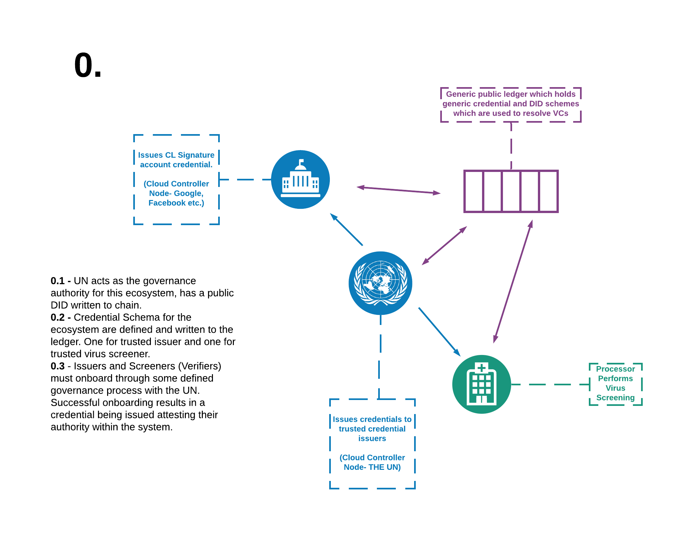
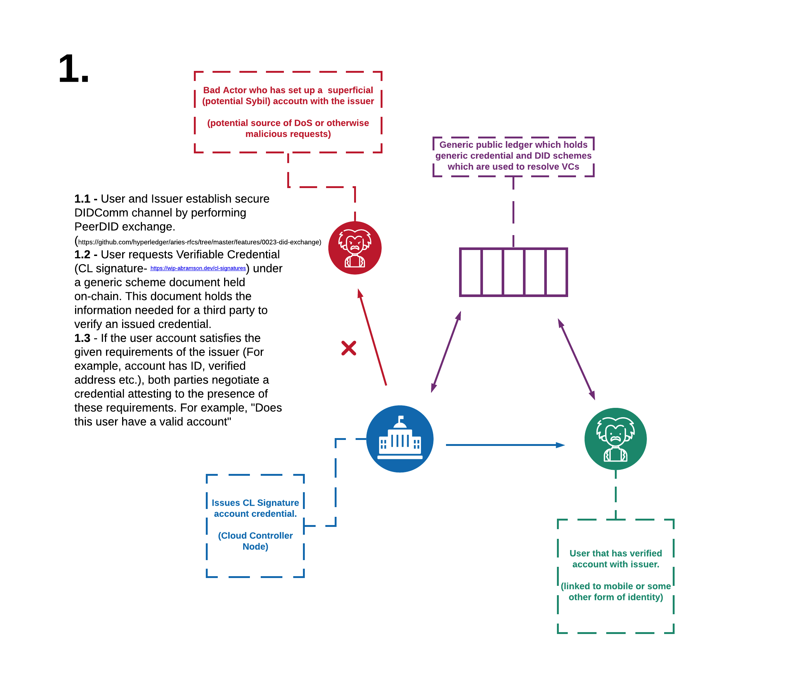
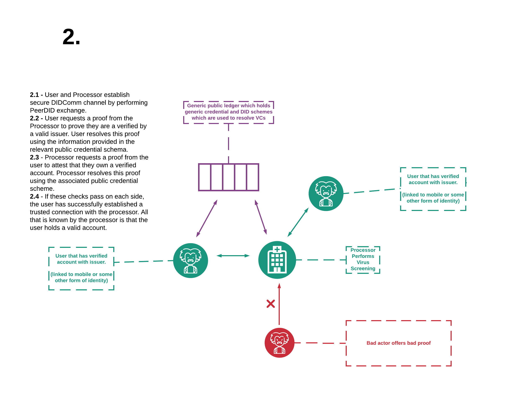
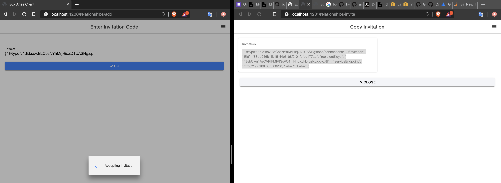
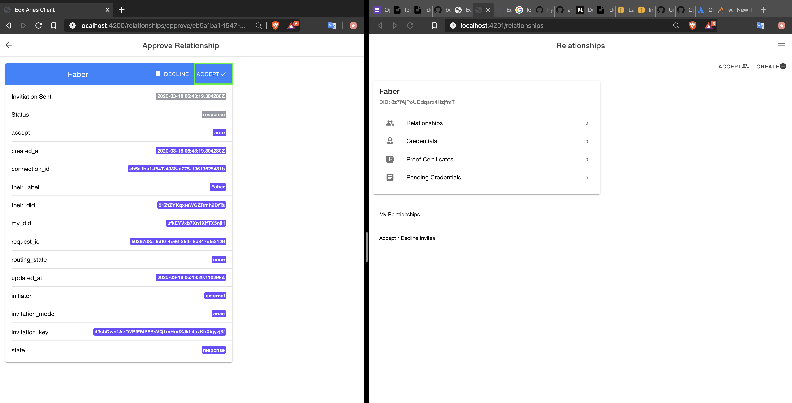
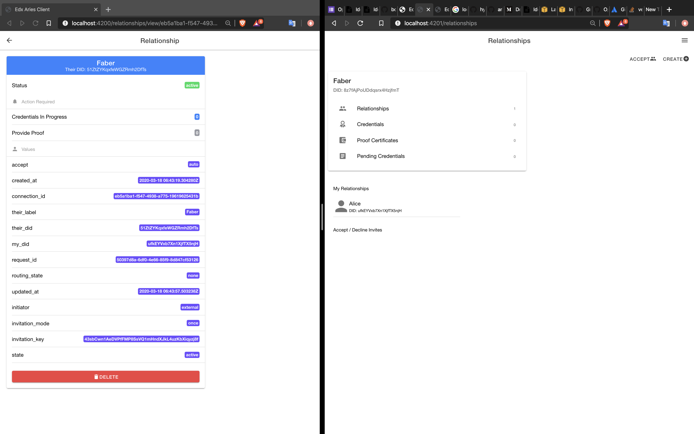

# Aries Cloud Controller Node

## Quickstart

Clone the repository locally.

Run in docker:

`$ cd ./docker`
`$ sh manage up`

If you're worried the set up script has failed because you can't connect, make sure to give this plenty of time. In my case it took ~8 minutes to set up.

In this example we're running a demo with three Agents; Alice, Faber and Acme. We're also running a small ledger network. Configuration details for this set up can be seen inside "docker/manage" and "docker/docker-compose.yml". In this case we use an implementation of Aries which is designed to run an agent as a cloud service. However, this communication can also be managed by smart phone apps (StreetCred). Cloud agents can be interacted with via a web front-end. This can be used to manage communication between Agents. The web front end allows us to create, issue and verify credentials with other parties.

Once the nodes have set up properly, they will be accessible on the following urls;

- For Alice, navigate to: http://localhost:4200
- For Faber, navigate to: http://localhost:4201
- For Acme, navigate to: http://localhost:4202

## Building a Credential Eco-System for Anonymous Verification of Google Account

We'd like users to be able to prove they are eligible for COVID screening without the service provider knowing the identity of the user. We can do this using DID documents, Verifiable Credentials (VCs) and some distributed identity concepts. We have a simple ecosystem to facilitate this which is outlined below;

Let the UN be Alice, Google be Faber and our user be Acme.

## Building Relationships Between Cloud Agents

First we need to create some connections to the other nodes in the eco-system. When two Agents connect, they do so with the PeerDID protocol. Each Agent shares a DID document with the other. For each relationship that an Agent has, it creates and shares a unique DID document. In this sense, the Agent assumes a different identity with different key pairs for each entity it interacts with.

Below is the landing page of the cloud-agent. We'll walk through a connection set up using the cloud agent GUI;

First, click create/ accept request on the respective agents. Then copy the connection request url into the recipients window.

The recipient will be asked whether they accept this connection. Accept the connection.

The connection will now appear on the landing page of the Agent who generated the request. 

Sharing DiD documents with the PeerDID protocol facilitates an encrypted channel. However, at this stage, trust has not been established. Trust is achieved by sharing proofs and proof requests over this channel.

## Defining Credentials
